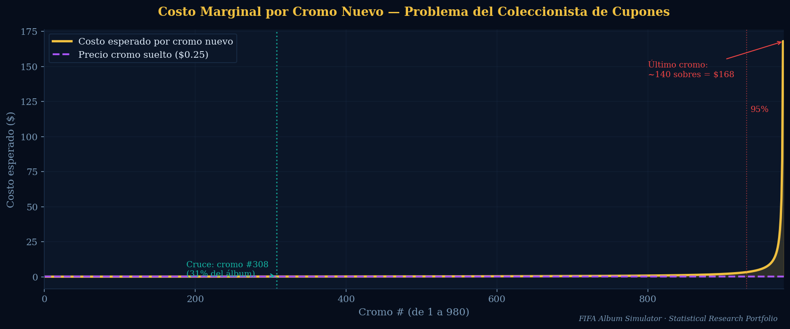
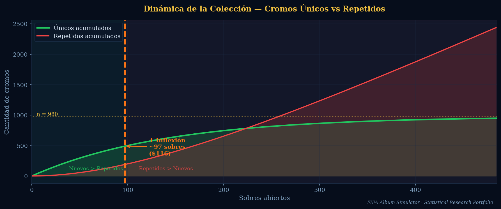
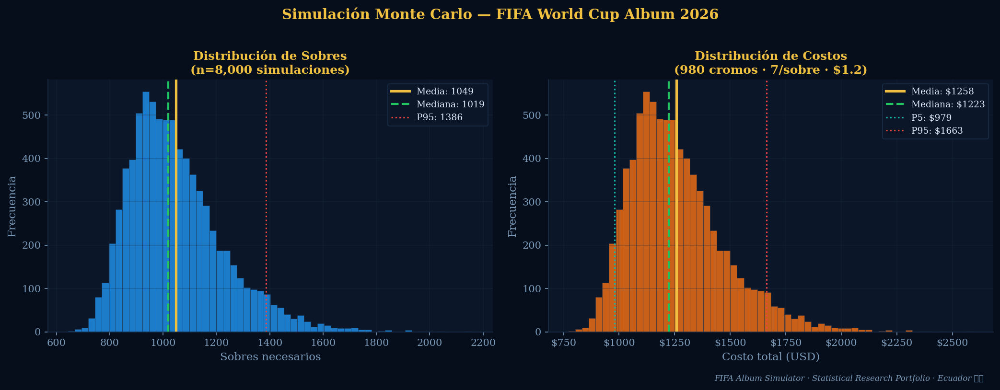
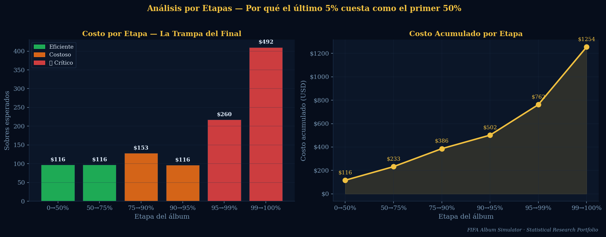

# 🏆 FIFA World Cup Album Simulator

**Statistical analysis of the real economics behind completing a sticker album.**  
Coupon Collector Problem · Monte Carlo Simulation · Behavioral Economics · Decision Strategy

> Ecuador context: 980 stickers · 7/pack · $1.20/pack (IVA included)

---

## What this is

I started collecting the FIFA 2026 album and got curious: *how much does this actually cost?*

Nobody had a serious answer, so I built one. This project applies the **Coupon Collector Problem** to model the expected cost of completing the album, runs 8,000 Monte Carlo simulations to get the real distribution, and adds a layer of behavioral economics to explain why people consistently overspend.

The result: an interactive dashboard where you input your current progress and get a concrete recommendation — whether to keep buying packs, start trading, or just buy the missing ones individually.

**Expected cost without any strategy: ~$1,254 USD.**  
With a trading strategy applied at the right moment: closer to $750–800.

---

## Results

| Metric | Value |
|--------|-------|
| Expected packs | ~1,045 |
| Expected cost (no strategy) | ~$1,254 |
| P95 cost (bad luck) | ~$1,663 |
| Inflection point | Pack #97 |
| Optimal trading window | 50%–75% of album |
| Crossover (packs → individual) | 31% of album |
| Duplicate rate at completion | ~86% |

---

## Project structure

```
fifa-album-simulator/
│
├── fifa_album_analysis.ipynb    # Main notebook — full analysis
├── dashboard/
│   └── fifa_album.jsx        # Interactive React dashboard
├── figures/
│   ├── fig1_marginal_cost.png   # Marginal cost per new sticker
│   ├── fig2_dynamics.png        # Unique vs duplicate dynamics
│   ├── fig3_montecarlo.png      # Monte Carlo distribution
│   ├── fig4_stages.png          # Cost per album stage
│   ├── fig5_trading.png         # Optimal trading window
│   ├── fig6_budget.png          # P(complete) vs budget
│   └── fig7_behavioral.png      # Behavioral economics
└── requirements.txt
```

---

## The math

The Coupon Collector Problem gives us:

$$E[T] = n \cdot H_n = n \sum_{k=1}^{n} \frac{1}{k}$$

For $n = 980$: $E[T] \approx 7{,}316$ stickers $\div$ 7/pack $= 1{,}045$ packs.

The marginal cost of each new sticker accelerates as the collection fills up:

$$E[T_k] = \frac{n}{n - k + 1}$$

The inflection point — where duplicates start outnumbering new stickers per pack — is at:

$$t^* = n \cdot \ln(2) \approx 97 \text{ packs}$$

The last sticker alone requires on average $n = 980$ draws, or **~140 packs** ($168).

---

## The behavioral layer

Four cognitive biases consistently inflate actual spending beyond the rational optimum:

| Bias | Premium | Mechanism |
|------|---------|-----------|
| Sunk Cost Fallacy | +15% | "I already spent $400, I can't stop now" |
| Progress Illusion | +12% | 95% feels close, but the last 5% costs as much as the first 50% |
| Loss Aversion | +12% | Abandoning an incomplete album feels worse than the money |
| Anchoring Effect | +10% | You think in $1.20/pack, not $1,254 total |

Combined behavioral premium: **+62%** over rational cost.

---

## The trading window

There is a mathematically defined window where trading duplicates makes sense:

- **Before 50%**: too few duplicates to trade effectively
- **50%–75%**: optimal window — maximum duplicates, still many missing stickers to exchange for
- **After 75%**: duplicates still useful but diminishing returns
- **After 31%**: individual purchase becomes cheaper than packs per sticker

The dashboard calculates your exact position and tells you which strategy to use.

---

## Dashboard features

The interactive React dashboard (available on Claude.ai) lets you:

- Input your current unique count or total packs opened
- Set how many duplicates you actually have
- Choose your trading preference (social / maybe / solo)
- See the exact recommended action for your situation
- Run a Monte Carlo simulation from your current position
- Compare the three routes: packs only / packs + trading / buy individually
- Model rare sticker costs separately

---

## Setup

```bash
git clone https://github.com/RBlJose/fifa-album-simulator
cd fifa-album-simulator
pip install -r requirements.txt
jupyter notebook fifa_album_analysis.ipynb
```

**requirements.txt**
```
numpy>=1.24.0
pandas>=2.0.0
scipy>=1.10.0
matplotlib>=3.7.0
seaborn>=0.12.0
jupyter>=1.0.0
```

---

## Key visualizations

### Marginal cost per sticker
The cost to get each new unique sticker accelerates exponentially. The last sticker expected: **~140 packs**.



### Collection dynamics
The crossover where duplicates exceed new stickers happens at pack **#97** — most people don't know this.



### Monte Carlo distribution
8,000 complete simulations. Mean: 1,049 packs / $1,258. The distribution is right-skewed — bad luck cases can hit $1,663+.



### Stage costs
The last 5% of stickers costs more than the first 50%.



---

## Research questions answered

1. **Expected cost to complete**: ~$1,254 (no strategy) / ~$750–800 (with trading)
2. **Packs needed on average**: ~1,045
3. **When duplicates dominate**: from pack #97 onwards
4. **Optimal trading window**: 50%–75% completion
5. **Probability of completing with $1,000 budget**: ~43%
6. **How much cognitive biases inflate spending**: +62% (~$776 extra)
7. **Cost of last 5% vs first 50%**: roughly equal

---

## Context

Album: FIFA World Cup 2026 (Panini)  
Region: Ecuador  
Pack price: $1.20 (IVA included)  
Stickers per pack: 7  
Total unique stickers: 980

The mathematical framework applies to any sticker album — change the parameters in the notebook header.

---

*Statistical Research Portfolio · Ecuador 🇪🇨*
